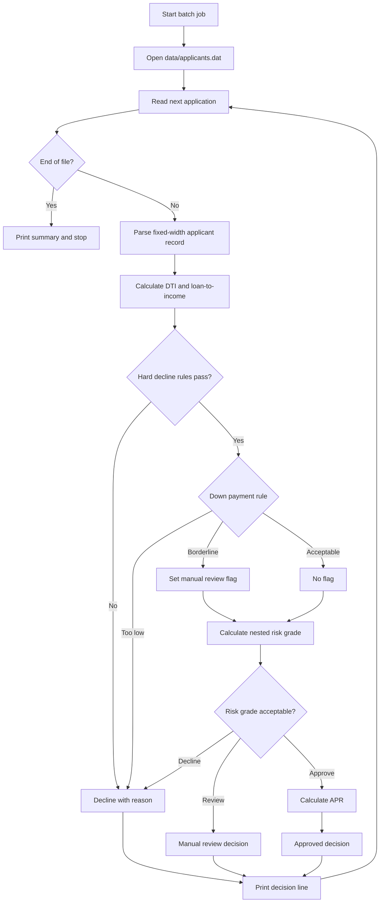

# Legacy COBOL Loan Approval System

Small hackathon project for legacy COBOL modernization demos. The program reads fixed-width loan applications, applies realistic bank pre-screen rules, calculates a risk grade and APR, then prints an approval decision.

## Project Structure

```text
loan-approvals-COBOL/
  copy/
    APPLICANT.cpy
    DECISION.cpy
  data/
    applicants.dat
    expected-output.txt
  src/
    LNMAIN.cbl
    LNRATE.cbl
    LNRULES.cbl
  run.ps1
  README.md
```

Total files: 8.

## Business Rules

The project uses 8 business rules. Two of them contain nested decision logic.

1. Minimum credit score is 580.
2. Debt-to-income ratio must be 43.00% or lower.
3. Requested loan amount cannot exceed 5 times annual income.
4. Applicant must have at least 24 months of employment history.
5. Applicant must have no bankruptcy in the last 7 years.
6. Applicant must have no more than 2 recent 30-day delinquencies.
7. Minimum down payment depends on loan type.
8. Final approval depends on calculated risk grade and base eligibility.

Nested rule 1: Down payment rule

```text
IF mortgage
  IF down payment < 20% THEN manual review
  IF down payment < 5% THEN decline
ELSE IF auto loan
  IF down payment < 10% THEN manual review
ELSE IF personal loan
  IF down payment is present THEN treat it as compensating factor
```

Nested rule 2: Risk grade rule

```text
IF credit score >= 740
  IF DTI <= 30% THEN grade A
  ELSE grade B
ELSE IF credit score >= 680
  IF DTI <= 36% THEN grade B
  ELSE grade C
ELSE IF credit score >= 620
  IF DTI <= 40% THEN grade C
  ELSE manual review
ELSE
  decline
```

## Input File Format

`data/applicants.dat` is fixed-width, which is common in legacy banking systems.

```text
01-05  Application ID
06-25  Applicant name
26-27  Loan type: MT mortgage, AU auto, PL personal
28-35  Annual income, no decimals
36-43  Requested loan amount, no decimals
44-48  Monthly debt, no decimals
49-51  Credit score
52-53  Employment months
54-55  Bankruptcy years ago, 99 means never
56-56  Recent delinquencies
57-64  Down payment, no decimals
```

## Run

Install GnuCOBOL, then from the project root:

```powershell
.\run.ps1
```

Or manually:

```powershell
cobc -x -free -I copy -o loan-approval.exe src\LNMAIN.cbl src\LNRULES.cbl src\LNRATE.cbl
.\loan-approval.exe
```

## Business Logic Flow Chart



## Modernization Ideas

This project is intentionally small, making it useful for a hackathon modernization story:

- Convert fixed-width input to JSON or REST API input.
- Extract rules from COBOL paragraphs into a rules engine.
- Add automated test cases for each approval rule.
- Replace batch output with a web dashboard.
- Preserve the COBOL results as the baseline for modernization parity testing.
